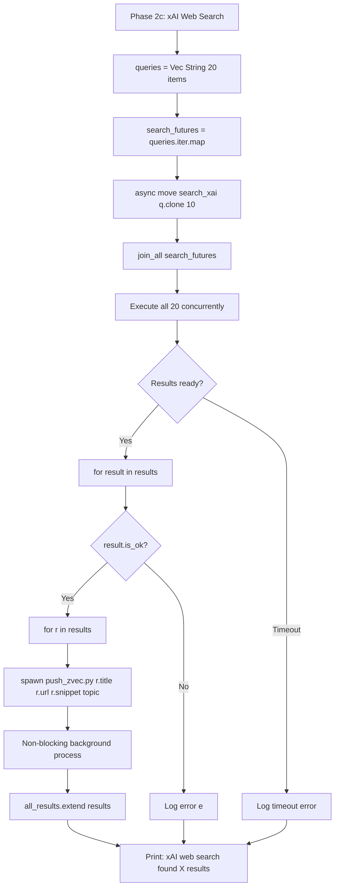
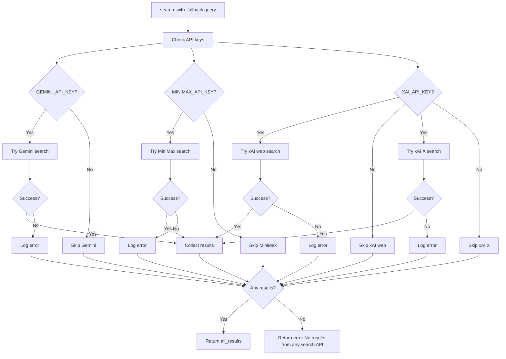
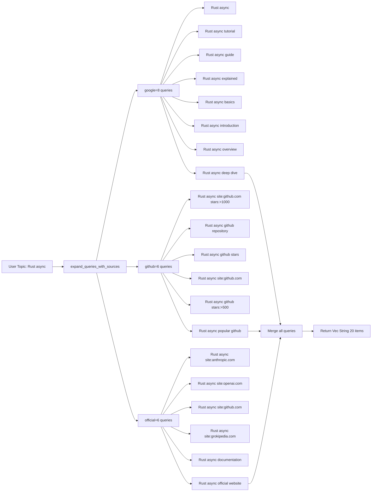
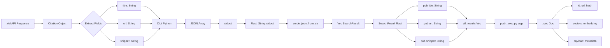
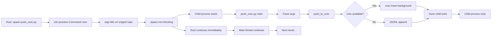

# xAI Integration - Data Flow Diagrams

## Complete System Flow

```mermaid
graph TD
    A[User: research --topic 'Rust async'] --> B[research.rs main]
    B --> C[Parse CLI args]
    C --> D[Initialize reqwest::Client]
    D --> E[expand_queries_with_sources]
    
    E --> F[Generate 20 queries]
    F --> G{API Keys Set?}
    
    G -->|GEMINI_API_KEY| H[Phase 2a: Gemini Search]
    G -->|MINIMAX_API_KEY| I[Phase 2b: MiniMax Search]
    G -->|XAI_API_KEY| J[Phase 2c: xAI Web Search]
    G -->|XAI_API_KEY| K[Phase 2d: xAI X Search]
    
    H --> H1[Create 20 futures]
    H1 --> H2[join_all execute]
    H2 --> H3[For each result: spawn push_zvec.py]
    H3 --> H4[Extend all_results]
    
    I --> I1[Create 20 futures]
    I1 --> I2[join_all execute]
    I2 --> I3[For each result: spawn push_zvec.py]
    I3 --> I4[Extend all_results]
    
    J --> J1[Create 20 futures]
    J1 --> J2[join_all execute]
    J2 --> J3[search_xai for each query]
    J3 --> J4[spawn_blocking: python xai_search.py]
    J4 --> J5[Parse JSON output]
    J5 --> J6[For each result: spawn push_zvec.py]
    J6 --> J7[Extend all_results]
    
    K --> K1[Create 20 futures]
    K1 --> K2[join_all execute]
    K2 --> K3[xai_x_search for each query]
    K3 --> K4[spawn_blocking: python xai_search.py --x-search]
    K4 --> K5[Parse JSON output]
    K5 --> K6[For each result: spawn push_zvec.py]
    K6 --> K7[Extend all_results]
    
    H4 --> L[Merge all_results]
    I4 --> L
    J7 --> L
    K7 --> L
    
    L --> M{Mode?}
    
    M -->|vectors| N[Save index.json<br/>zvec in background]
    M -->|json| O[Save {topic}_raw.json]
    M -->|md| P[Rank & deduplicate]
    
    P --> Q[Fetch top N pages]
    Q --> R[Synthesize with LLM]
    R --> S[Generate markdown report]
    
    N --> T[Done ✓]
    O --> T
    S --> T
```

## xAI Python Bridge Flow

```mermaid
graph LR
    A[Rust: search_xai query] --> B[spawn_blocking]
    B --> C[python3 xai_search.py query --limit N]
    C --> D[Load XAI_API_KEY]
    D --> E[Client api_key=key]
    E --> F{use_x_search?}
    
    F -->|No| G[tools=[web_search]]
    F -->|Yes| H[tools=[x_search]]
    
    G --> I[chat.create model=grok-4-1-fast-reasoning]
    H --> I
    
    I --> J[chat.append user Search for: query]
    J --> K[for response, chunk in chat.stream]
    K --> L[response_obj = response]
    L --> M[Extract response_obj.citations]
    
    M --> N[Format to JSON array]
    N --> O[print json.dumps results]
    O --> P[Rust: Parse stdout JSON]
    P --> Q[Return Vec SearchResult]
```

## Concurrent Execution Pattern



## Vector Storage Flow

```mermaid
graph LR
    A[Search Result] --> B[spawn push_zvec.py title url snippet topic]
    B --> C{zvec available?}
    
    C -->|Yes| D[Try open ./zvec_data]
    C -->|No| E[Use JSONL fallback]
    
    D --> F{Collection exists?}
    
    F -->|No| G[Create schema name=research vectors=embedding 768]
    F -->|Yes| H[Use existing collection]
    
    G --> I[collection = create_and_open]
    H --> J[collection = open]
    
    I --> K
    J --> K[Get embedding text=title+snippet]
    
    K --> L{Gemini API available?}
    
    L -->|Yes| M[POST gemini-embedding-001:embedContent]
    L -->|No| N[Return zero vector 768]
    
    M --> O[Parse embedding.values]
    O --> P[collection.insert Doc id=url_hash vectors=embedding payload=data]
    
    N --> Q[Write to {topic}_vectors.jsonl]
    P --> Q
    
    E --> Q
    
    Q --> R[Done ✓]
```

## Error Handling & Fallback Flow



## Query Expansion Strategy



## Performance Timeline

```mermaid
gantt
    title xAI Integration Execution Timeline
    dateFormat  X
    axisFormat %L ms
    
    section Phase 1: Setup
    Parse CLI args           :0, 50
    Initialize Client        :50, 30
    Expand queries (20)      :80, 100
    
    section Phase 2a: Gemini
    Create 20 futures        :180, 20
    Execute concurrently     :200, 8000
    Push to zvec (bg)        :200, 2000
    Process results          :8200, 50
    
    section Phase 2b: MiniMax
    Create 20 futures        :180, 20
    Execute concurrently     :200, 10000
    Push to zvec (bg)        :200, 2500
    Process results          :10200, 50
    
    section Phase 2c: xAI Web
    Create 20 futures        :180, 20
    Execute concurrently     :200, 12000
    Python bridge calls      :200, 11000
    Parse JSON               :11200, 500
    Push to zvec (bg)        :200, 3000
    Process results          :12200, 50
    
    section Phase 2d: xAI X
    Create 20 futures        :180, 20
    Execute concurrently     :200, 12000
    Python bridge calls      :200, 11000
    Parse JSON               :11200, 500
    Push to zvec (bg)        :200, 3000
    Process results          :12200, 50
    
    section Phase 3: Output
    Merge all results        :12250, 100
    Save index/deduplicate   :12350, 200
    Done                     :12550, 50
```



## Component Interaction Diagram

```mermaid
graph TB
    A[User CLI] --> B[research.py wrapper]
    B --> C[research binary Rust]
    
    C --> D[lib.rs public API]
    D --> E[search.rs module]
    D --> F[rank.rs module]
    D --> G[fetch.rs module]
    
    E --> H[search_xai function]
    E --> I[xai_x_search function]
    E --> J[search_gemini function]
    E --> K[search_minimax function]
    
    H --> L[spawn_blocking]
    I --> L
    
    L --> M[python3 xai_search.py]
    M --> N[xai_search.py Python]
    
    N --> O[xAI SDK Client]
    O --> P[xAI API grok-4-1-fast-reasoning]
    
    P --> Q[Citations metadata]
    Q --> R[Format JSON]
    R --> S[stdout]
    
    S --> T[Rust: Parse JSON]
    T --> U[Vec SearchResult]
    
    U --> V[research.rs]
    V --> W[spawn push_zvec.py]
    
    W --> X[push_zvec.py Python]
    X --> Y{zvec library?}
    
    Y -->|Yes| Z[zvec.insert]
    Y -->|No| AA[JSONL file]
    
    Z --> AB[zvec_data collection]
    AA --> AC[{topic}_vectors.jsonl]
```

## Data Structure Flow



## Background Process Flow


